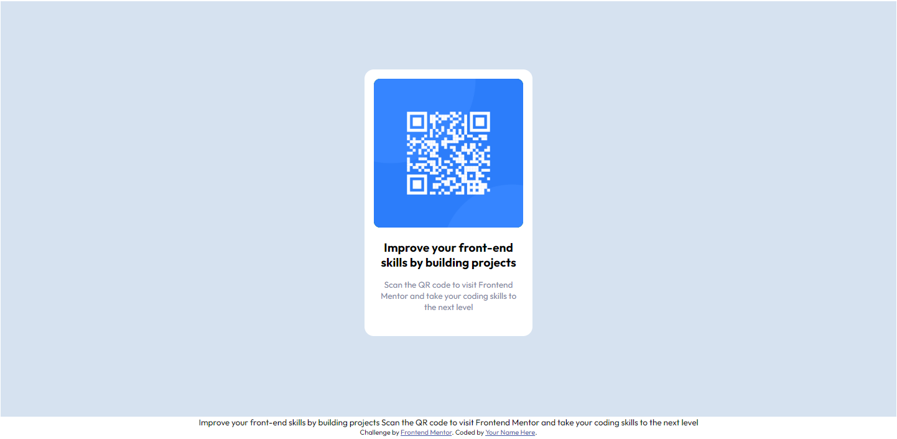

# Frontend Mentor - QR code component solution

This is a solution to the [QR code component challenge on Frontend Mentor](https://www.frontendmentor.io/challenges/qr-code-component-iux_sIO_H). Frontend Mentor challenges help you improve your coding skills by building realistic projects. 

## Table of contents

- [Overview](#overview)
  - [Screenshot](#screenshot)
  - [Links](#links)
- [My process](#my-process)
  - [Built with](#built-with)
  - [What I learned](#what-i-learned)
  - [Continued development](#continued-development)
  - [Useful resources](#useful-resources)
- [Author](#author)
- [Acknowledgments](#acknowledgments)


## Overview

This course was just about styling a QR code to look like a requirement
I was not provided with a Figma design therefore I had to do it by eye

### Screenshot



### Links

- Solution URL: [Add solution URL here](https://your-solution-url.com)
- Live Site URL: [Add live site URL here](https://qr-code-component-62p.pages.dev/)

## My process

1. Styled body
2. Imported fonts
3. Learnt how to create global variables https://www.w3schools.com/css/css3_variables.asp
4. Went through [Style Guide](archive\style-guide.md) and updated all

### Built with

- Semantic HTML5 markup
- CSS custom properties


### What I learned

Learnt about how to add global variables- see below

```css
:root {
    --White: hsl(0, 0%, 100%);
    --Light_gray: hsl(212, 45%, 89%);
    --Grayish_blue: hsl(220, 15%, 55%);
    --Dark_blue: hsl(218, 44%, 22%);

    --off-white: rgba(255, 255, 255, 0.5); 
    --blue: hsl(217, 87%, 57%);
}
```


### Continued development

1. Position
2. Flexbox / other methods


### Useful resources

- [Markdown Guide](https://www.markdownguide.org) - A guide to help learn markdown
- [Fireshot](https://getfireshot.com) - For capturing images


## Author

- Website - [Jamie Kent](https://www.jamiekent.me)
- Frontend Mentor - [@Jamie-Kent](https://www.frontendmentor.io/profile/Jamie-Kent)


## Acknowledgments

Angela - she said the website was good in the Udemy lesson
